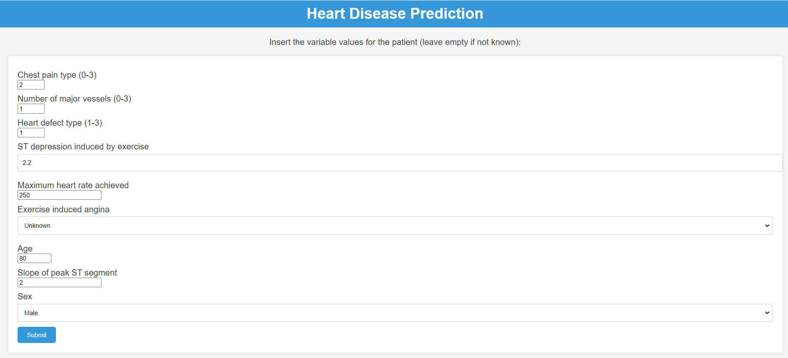
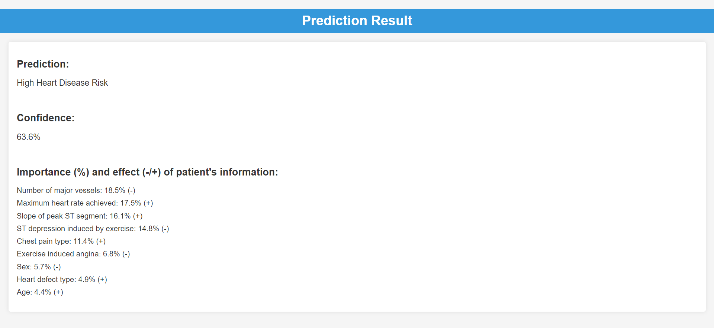

# Heart Disease Prediction Web App

Flask app that predicts the risk of heart disease based on a Gradient-boosted Trees ML model created from this <a href="https://www.kaggle.com/datasets/johnsmith88/heart-disease-dataset">dataset</a>, and shows the confidence in the prediction as well as the factors behind the prediction (explainability). Synthetic data with null values and target=0 (no heart disease) was added to the dataset in order to correct a model bias for unknown variables.





# Getting Started
  
## Dependencies

### Docker

**Linux:**
To install Docker on Linux, follow the instructions for your specific distribution on the [Docker website](https://docs.docker.com/engine/install/).

**Windows:**
If you're using Windows, you can install Docker Desktop by downloading it from the [Docker Desktop for Windows](https://www.docker.com/products/docker-desktop) page.


### Docker Compose

**Linux:**
To install Docker Compose on Linux, follow the instructions on the [Docker Compose website](https://docs.docker.com/compose/install/).

**Windows:**
Docker Desktop for Windows includes Docker Compose. You don't need to install it separately.

## Installing

To install this application, follow these steps:  

1. Clone this repository to your local machine:
   ```shell
   git clone https://github.com/leo-cb/HeartDiseasePrediction_WebApp.git  
2. Start the docker-compose service:
   
   ```shell
   docker-compose up -d

## Executing program

Once the docker-compose container is running, you can access the application by opening a web browser and navigating to http://localhost:5000. From there, you can enter patient data and receive a prediction of their likelihood of developing heart disease, as well as the confidence in that prediction and the each factor weight behind it.

# Description

## Overview

The application serves several key functions:  

1. **Model Loading:** It loads a GBT binary classification model from a pickle file.
2. **API Endpoint:** The application creates an endpoint at /predict, which handles API requests. To access this endpoint, a valid API key (stored in a MongoDB collection) is required. It provides predictions (0 or 1), confidence percentages, and SHAP values for each variable used in the model.
3. **API Key Management:** It includes library files to create API keys and insert the hashed key into the MongoDB collection. It also provides a function to check if a given API key exists.
4. **Unit Tests:** The application includes unit tests located in the /tests/ directory.
5. **Web Interface:** It generates a web page called index.html, allowing users to input variable values and submit them. The output is displayed in results.html.  

## Continuous integration/Continuous deployment

### CI workflow  

The repository has a CI workflow in .github/workflows named **python-webapp.yml** that runs on every push and pull request on both main and dev branches. It runs linting and runs the tests in /tests/.

### CD workflow  

The repository has a CD workflow in .github/workflows named **deploy.yml** that runs on a successful CI workflow run on the main branch. It deploys the application to a Debian-based host by ssh access, and runs the service.


